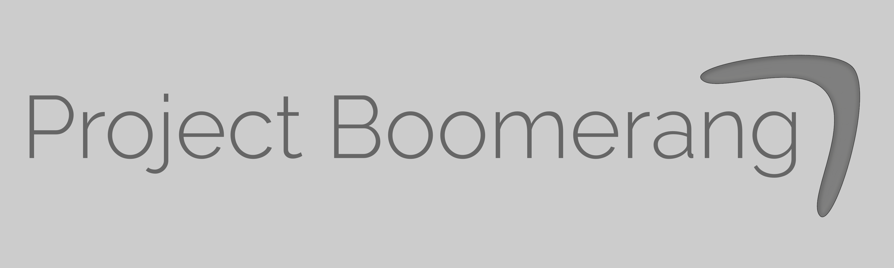

# Project Boomerang
<br>
:point_right: Howdy! Welcome to Project Boomerang's GitHub repository. Project Boomerang is a yet-to-be-titled video game project collaboration.

## Got Questions?
Got a question about Project Boomerang? Go ahead and join our [Discord Server](https://discord.gg/NaM4FtJ) and ask one of the collaborators.

## Code of Conduct
Before contributing, please read the project [Code of Conduct](CODE_OF_CONDUCT.md). This project is thusly governed, and all contributors and collaborators are expected to withhold these guidelines. Please report any violation of these guidelines to seungminleader@gmail.com, using the guidelines discussed in the next section.

## Contacting a Collaborator
Want to directly contact a collaborator? You can email us, following these guidelines:

Your email subject should include the following:<br>
`[Project Boomerang] - OneWordProblem - Longer Description`<br>
ex. `[Project Boomerang] - Question - How do I contact a collaborator?`

You should sign your email as such:
```
FirstName LastName or Alias
your email address
optional: phone #  
```
`seungminleader@gmail.com` :arrow_right: Andrew Woo (Project Manager, Developer)<br>
`pyertersquires@gmail.com` :arrow_right: Porter Squires (Developer)<br>
`awrishkhan@gmail.com` :arrow_right: Awrish Khan (Developer)

## Open Collaborator Positions
Here are some positions that we could use collaborators (not contributers):
```
- [x2] Assset Artist
- [x1] C++ Developer
- [x2] Lua Developer
```

## Credits
Collaborators
- ![dev] `Andrew Woo`
- ![dev] `Brandon Yau`
- ![dev] `Porter Squires`
- ![dev] `Awrish Khan`

## License
```
Modified MIT License

Copyright 2020 Andrew Woo, Porter Squires, Brandon Yau, and Awrish Khan

 * Permission is hereby granted, free of charge, to any person obtaining a copy of this software and associated documentation files (the "Software"),
 * to deal in the Software without restriction, including without limitation the rights to use, copy, modify, merge, publish, distribute, sublicense,
 * and/or sell copies of the Software, and to permit persons to whom the Software is furnished to do so, subject to the following conditions:
 *
 * The above copyright notice and this permission notice shall be included in all copies or substantial portions of the Software.
 *
 * Restrictions:
 >  The Software may not be sold unless significant, mechanics changing modifications are made by the seller, or unless the buyer
 >  understands an unmodified version of the Software is available elsewhere free of charge, and agrees to buy the Software given
 >  this knowledge.
 *
 * THE SOFTWARE IS PROVIDED "AS IS", WITHOUT WARRANTY OF ANY KIND, EXPRESS OR IMPLIED, INCLUDING BUT NOT LIMITED TO THE WARRANTIES OF
 * MERCHANTABILITY, FITNESS FOR A PARTICULAR PURPOSE AND NONINFRINGEMENT. IN NO EVENT SHALL THE AUTHORS OR COPYRIGHT HOLDERS BE LIABLE
 * FOR ANY CLAIM, DAMAGES OR OTHER LIABILITY, WHETHER IN AN ACTION OF CONTRACT, TORT OR OTHERWISE, ARISING FROM, OUT OF OR IN CONNECTION
 * WITH THE SOFTWARE OR THE USE OR OTHER DEALINGS IN THE SOFTWARE.
 ```


 [dev]: https://img.shields.io/badge/-dev-brightgreen?style=flat-square